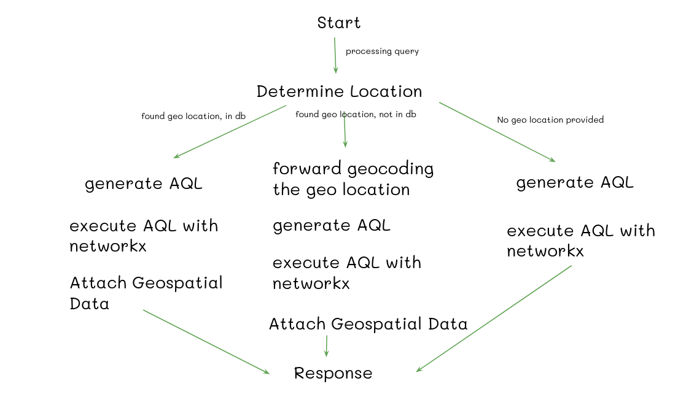

# Arango DB Hackathon Submission

# Green Living Graph Based Agentic App Project

- Web Apps : [https://adbh.pages.dev](https://adbh.pages.dev/)
- Presentation: [Presentation](./docs/presentation.pdf)
- Youtube video : [https://youtu.be/UNBXhglRGzs](https://youtu.be/UNBXhglRGzs)

<video src="https://github.com/JfrAziz/adbh/raw/refs/heads/master/docs/apps.mp4" controls="controls" style="max-width: 730px;">
</video>

https://github.com/user-attachments/assets/db1c5523-fb9d-4ba1-94c6-b97c8c587b2f

## Table of Contents

- [Arango DB Hackathon Submission](#arango-db-hackathon-submission)
- [Green Living Graph Based Agentic App Project](#green-living-graph-based-agentic-app-project)
  - [Table of Contents](#table-of-contents)
  - [Project Overview](#project-overview)
  - [Data Sources](#data-sources)
  - [Data Processing and Graph Construction](#data-processing-and-graph-construction)
  - [Agentic App Functionality](#agentic-app-functionality)

## Project Overview

The Green Living Data Analysis Project aims to promote sustainable living by integrating various environmental datasets into a comprehensive knowledge graph. This project leverages data from satellite imagery, mapping services, and news articles to provide insights into green infrastructure, pollution levels, and related news.

## Data Sources

- **Sentinel Copernicus Satellite Imagery**: Provides high-resolution Earth observation data for environmental monitoring.
- **OpenStreetMap (OSM)**: An open-source mapping platform offering detailed information on geographical features, including green spaces and infrastructure.
- **Event Registry**: Aggregates global news articles, enabling analysis of environmental events and trends.

## Data Processing and Graph Construction

1. **Geospatial Data Conversion**:
   - Converted geospatial data into efficient formats such as Parquet and GeoPackage (GPKG) to optimize storage and access.
   - Performed spatial joins to integrate various geospatial datasets, aligning features based on spatial relationships.

2. **News Data Processing**:
   - Applied Named Entity Recognition (NER) techniques to extract entities like organizations, locations, and environmental terms from news articles.
   - Utilized Large Language Models (LLMs) to contextualize these entities, linking them to existing graph nodes and uncovering new relationships.

3. **Graph Database Schema**:
   - **Nodes**:
     - *Object*: Represents entities such as Power Generators, EV Charging Stations, Greenery Lands, Public Transport Stations, and Waste Recycle Facilities.
     - *ObjectType*: Categorizes objects into specific types (e.g., solar power generator, park).
     - *Country* and *City*: Geographical entities with associated attributes.
     - *Grid*: Represents population density and gaseous pollutant levels (CO, CH₄, NO₂).
     - *News*: Contains news articles with attributes like content and date.
     - *NewsEntity* and *NewsEntityType*: Extracted entities from news articles and their classifications.

   - **Edges**:
     - `City` → `Country`: `located_in`
     - `Object` → `City`: `located_in`
     - `Grid` → `City`: `located_in`
     - `Object` → `ObjectType`: `is_a`
     - `News` → `NewsEntity`: `mentions`
     - `News` → `City`: `related_to`
     - `News` → `Country`: `related_to`
     - `NewsEntity` → `NewsEntityType`: `belongs_to`

## Agentic App Functionality

The Agentic App dynamically retrieves and processes natural language queries based on user intent. It offers:

- **Geospatial Data Analysis**: Provides insights into the distribution and accessibility of green infrastructure and pollutant levels.
- **News Retrieval**: Aggregates and analyzes news related to environmental issues to keep communities informed.

*Example Queries*:

- "Find EV charging stations in Berlin."
- "How many greenery lands are in Hamburg?"
- "Show me the location with the highest CO level in Bayern."

Here how it's works

